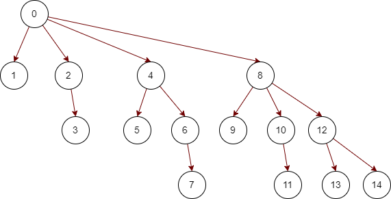

# recodebOOK_3

开第三本，主要是更改一下记录的格式

2022/3/11

### 2049.统计最高分的节点数目 middle 3/11 

:confused: :world_map:

又是邻接表建图

idx 值标记的是边 i标记的是节点原编号

e[idx] 保存该边指向的节点

he[i] 保存的是该点邻接的第一条边的idx值

ne[idx] 保存idx边保存邻接的下一条边

规则见题：简述为删除一个点后，

剩下的如果为一个连通块，则分数为他的节点数，

如果剩下的为多个，则为多个连通块相乘的积。

返回的是最多分数节点的个数

先建图，然后dfs得到f[] 保存每个节点作为根节点的子树的节点数目

对于大树的根节点来说 得分 a=Σ f[i] （i为0结点的子节点）

对于非根节点来说，删除该节点x后，a还应该乘上（n-f(x)）即根据树的定义，还有一个连通块的节点数等于n-f(x)并且相当于与x的子树通过x的入边相连接

### 590.N叉树的后序遍历 easy 3/12

后序遍历，直接dfs递归做法最快


### 平衡二叉树最多节点数计算

如果根节点高度为1（有的可以改为深度从0开始，反正1偏置）

S[1]=1,S[2]=2

S[i]=S[i-1]+S[i-2]+1

### 393.UTF-8编码验证

简单模拟

UTF-8是一个不定长的编码，最多由四个字节构成

字节1：0xxxxxxx

字节2：110xxxxx 10xxxxxx

字节3：1110xxxx 10xxxxxx 10xxxxxx

字节4：11110xxx 10xxxxxx 10xxxxxx 10xxxxxx

重点在于怎么写这个判断模拟的地方

由于输入的是数组，所以我们要根据第一个数字的前缀拍段一共多少字节有效

😅住了家人们，原来这个题不是判断某几个字节是不是一个UTF8，而是一串序列，相当于一段字符。

所以这个循环得判断多一点通俗一点

接上得到cnt如果是有效的话，检测该cnt个后续字节是否满足标准，然后再跳转到下一个UTF8开头进行下一个循环

期间可以针对cnt，data[]内字节的长度等进行长度判断提前退出（也是防止越界）


### 599.两个列表的最小索引总和 easy 3/14

哈希表模拟题

先用哈希表记录第一个序列的值和索引值

再遍历第二个，再通过哈希表的查询以及索引值的大小，来添加，清空重置，或者跳过答案值

### 2044.统计按位或能得到最大值的子集数目 middle 3/15

首先说到子集统计，如果集合本身个数不多的情况下，可以选择利用int或者long的比特位来统计i位是否被本次子集统计使用

当然有的情况也可以针对当前子集里面部分数的多少来，也可能数频统计获得一定的加速

1994.好子集的数目 之前做过，困难题，到时候可以一并做做。

其一优化，状压DP

在之前的遍历中，对于state递增的趋势而言，显然有一部分被重复计算了，所以我们加入DP数组

f[state] = f[state-lowbit]|num[idx]

转移方程简单来说就是把state中最低的1剃掉（state-lowbit）然后取并num[idx]

~~注意这里求得是最低，不是最高
并不是类似于1110= 1000 + 0110这种扩展，鹅好像也不是不可以，可以试试~~

好吧其实也可以 状态s我们是递增遍历
假如状态1110 可以由 1000+0110 得到
也可以由 1100 + 0010 得到，重要的是dp的思想

求得最低1比特位 lowbit = (s &-s) 学到了

这个lowbit以及对应的idx值我们用个hashmap来存储


### 432.全O(1)的数据结构

设计一个用于储存字符串计数的数据结构，能够返回计数最小和最大的字符串（由题目可知复杂度要求）

虽然插入的长度不超过10，但是哈希表仅仅能够做到O(1)的计数，无法做到O(1)的查询

采取LFUCache的思路，自定义节点并手写双链表
    
前置 🧀 146. LRU 缓存机制

### 146.LRU缓存 middle 3/17

实现一个最近最少使用缓存约束的数据结构，删除最后使用

用set储存是否已经被储存

并建立双向链表储存

如果已经储存，则把节点移动到表头refresh

如果未储存，容量未满，则加入到表头

如果储存已满，则删掉表尾节点，再加入表头

(以上操作均对应代码中的函数)

减少左右节点的判空操作，我们可以头尾建立两个哨兵节点（key=-1,value=-1）作为


### 720.词典中最长的单词 middle 3/17

这个最长需要单词由给定字符串序列中其他词汇挨个构成

比如"word" 还必须要有"w""wo""wor"

数据量小，本身可以set来做，但是这里我复习一下trie树

str.compareTo(str2) 比较两个字符串asc码大小，可以用于返回最小序列，如果返回>0 则为str更大

### 2043.简易银行系统 middle 3/18

简单模拟操作即可，不用搞花的

麻，用例来花的，超出用户的，用户标号比下标加一😅

### 606.根据二叉树创建字符串 easy 3/19

根据前序遍历，和括号配合一下，构建字符串

这里的最外层（根节点）没有括号，最后返回的时候解决一下就好。

如果左子树为空但是右子树不为空的话要()占位


### 2039.网络空闲的时刻 middle 3/20

对于每个服务器而言（除开根服务器），可以通过dij获得一个最短路径长度（每条边权重为1），即第一次收到返回消息的时间为di=2*dist[i]

由于服务器还存在重新发送信息的操作，如果在收到之前，还能够发送消息（di<=patence[i]）

如果会重新发送，则最后停止时间为（di-1）/t *t + di

然后选出所有结点的最大值

无论是建图还是dist，直接就static一个数组，每次重新fill一下速度是最快的

dij对于每个边权重相同的话，可以直接利用队列来处理（而不是优先堆）因为越后面加入队列，则边越多，路径也就越长。

蛤蛤其实这不就是BFS嘛

注意最后是问最早的空闲时间，所以我们需要把最后算出来的最大时间（最后还在活动的时间，最后一个接收到返回信息的时间）**+1**作为返回

### 653. 两数之和 IV - 输入 BST easy 3/21

可以简单的递归左右子树，用set储存已经存在的值，并且判断当前值

但是这个方法没有利用BST树的性质

后面会补上一个双指针利用BST树的性质    


### 2038. 如果相邻两个颜色均相同则删除当前颜色 middle 3/22

甲先手，乙后手，甲必须消除AAA中间的A，乙必须消出BBB中间的B

### 661.图片平滑器 easy 3/24

对于本题的数据范围

简单朴素的做法是我们可以想到利用八个方向的遍历模拟，直接得到平均值

但是这里我们利用二位前缀和来进行一个优化（模板题304）

**前缀和一般来说构建数组从1开始有意义，因为这样可以避免处理第一个元素**

简单来说一维前缀和a[i]指的是下标i及以前的，然后a[i][j]相当于就是对于二维数组左上角的部分的和（到时候取的时候的减去相对复杂一丢丢）

### 172.阶乘后的零 middle 3/25

对于一个阶乘数来说，0的个数取绝于他10的因子数，并且由质因数2*5的来，
因此这个题显然为质因数统计运用题目

如何找到一个数的质因数的个数呢

对于p而言，至少含有1个p的倍数 c1=n/p

至少含有k个p的倍数 cn = n / p^k

总个数c =  c1+c2+...cn

c互相之间有个包容子集的关系，之和就为总数

显然5要小于2的个数，所以我们只用统计5的质因数即可

这里可以通过递归的方式来进行统计


### 682.棒球比赛 easy 3/26

相当于给定一个字符串，然后解析这个字符串表示的得分含义（有的是字符，需要和前面的得分数字等进行操作）

虽然一开始我想的是，最多会操作前面两个得分，但是涉及到前一个操作无效的情况，还不如直接开一个纯粹记录得分的int数组，能够简单有效的记录得分，(前一次得分无效直接利用数组的尾指针前移即可)最后在统一相加即可

### 2028.找出缺失的观测数据 middle 3/27

一堆数据，丢失一部分，但是给你平均值，你能否给出其中一组满足条件的丢失数组

这个可以模拟，比如丢失n,剩余m，（m+n）*mean - sum(n个已知) 的范围 [n,6*n]

如果在范围外面，则可以直接返回空数组

如果在范围内，我们可以首先利用平均的想法，分配每个筛子的个数，向下取整，如果不能正好平分，则我们可以看向下取整后还差多少，然后在部分骰子+1即可。


### 693.交替位二进制数 easy 3/28

判断n这个数二进制是否是01交替的

除了简单模拟，还有一个很巧妙的利用二进制计算的方法

简单模拟也提一句，一开始用-1（111111...111）来进行异或比较效果非常好，后续在用0和1与n的剩下位数依次异或

原因是第一次可以异或结果为（11111...0）或者（11111...1），不会出现非零，因为第一次无论如何都不会失败，如果用1的话则需要与后面的循环判断分离。

🐎如果一个数为交替数，那么他移位并与原数异或后会得到：

x=0000...1111

x+1=0001...0000

x&(x+1)==0

可以利用这个来判断

### 2024.考试的最大困扰度 middle 3/29

对一个字符串{T,F}操作不超过k次，最大化连续相同的次数

比方说我们可以这样想（先换成01）

00001000100 k=2,如果换成连续的0的话，其实我们需要找连续包含两个1的最长连续字段

同理我们找最长连续F就是找包含k个T的最长连续字段
。最长T同理

利用滑动窗口来找


### 728.自除数 easy 3/31

简单模拟即可，或者提前打表（哈希或者数组），然后输出


### 744.寻找比目标字母大的最小字母 easy 4/3

简单模拟题，但是由于给定有序，则可以使用二分的做法

如果不存在也要返回第一个

### 307.区域和检索 - 数组可修改 middle 4/4


转叶总的总结：针对该题延展的一类题

1.数组不变，求区间和：「前缀和」、「树状数组」、「线段树」

2.多次修改某个数，求区间和：「树状数组」、「线段树」

3.多次整体修改某个区间，求区间和：「线段树」、「树状数组」（看修改区间的数据范围）

4.多次将某个区间变成同一个数，求区间和：「线段树」、「树状数组」（看修改区间的数据范围）

虽然线段树范围最多，但是也最难写，所以我们一般除开第四种情况不考虑

1.简单求区间和，前缀和

2.多次将某个区间变成同一个数，线段树

3.其他情况，树状数组


题目要求是对一个数据结构完成查询某个位置，以及区域和

这里今天就先学经典的树状数组（代码后面还有树状数组的模板）将复杂度降为ln

主要核心是从二进制分解进行出发理解

把区间储存的值**分层**是最核心的观点，

**我的总结就是一种分层化的前缀和（带左右边界）**

在tree[]中 idx为1101中存储的是什么？sum(1,13)

1101 = 1*2^3 + 1*2^2 + 0*2^1 + 1*2^0 = 1000+0100+0001

这样就分成了三层（注意下面我的分层也就是tree里面的下标）

**有几个1就是第几层**

1000层储存（1，8）sum

1000+0100层储存（9，12）sum

1000+0100+0001层储存（13，13）sum

新数组的下标从1开始，而原数组的下标从0开始

一共有两个核心基础操作：

一个是add 用于更新tree

一个是query 用于利用tree来查询原数组给定左右边界的sum

🐎为什么树状数组快呢？

如果是前缀和，那么更新的话idx后面所有都需要更新，On的复杂度

但是如果按照我们的分层思想，那么只需要更新同一层，同一个根节点后面的即可

例如第一个数更新了，要更新0001，0010，0100，1000

0010=0001+0001，0100=0010+0010，1000=0100+0100

这个图很好的显示了他的树形关系

**范围和由指向边的形式表达**

**前缀和就是从节点到0根结点的一个追溯**

**更新操作只需要更新同一个根节点，同一层，后面的节点**



https://blog.csdn.net/Yaokai_AssultMaster/article/details/79492190 讲的很好,图也是仿作的，🙇‍

### 762.二进制表示中质数个计算置位 easy 4/5

在闭区间 [left, right] 范围内，统计并返回 计算置位位数为质数 的整数个数。

计算置位的位数就是二进制表示的1的个数

打表获得32以前的质数，然后再利用lowbit获得1的个数

191.位1的个数有对1的个数进行分治处理的更优解

### 310.最小高度树 middle 4/6

给定一个n个节点的联通图，并且有n-1个无向边（树结构）
0==n-1为标记

返回所有以i节点为根的树的高度在所有节点里最小的节点标号

树形dp模板题

虽然给我们一个图我们可以把他看作为一个无相连通，但是作为树结构却是单向，唯一的

假设我们以0结点为根构建一个树，我们对其中的u节点进行分析


此时我们有两个dp数组f和g，f[u]存储从u往下走的最大高度，g[u]存储从u往上走的最大高度。

f通过dfs可以简单的得到，但是g需要处理

走1，3路线，max(g[u],g[va]+1)

走1，2路线，我们需要考虑va往下最大深度是否经过了u（如果这个时候我们使用f[va]则不满足u为根节点的树状结构）

所以我们还需要p[i]来记录向下最大值的节点为多少

此时我们考虑用f2[va]+1即va往下的次大+1来更新🐎（这里的次大有歧义，应该是走另一边子树的最大深度，不是以va为根的次大，应该是另一颗子树的最大深度）

虽然说是考虑往上处理，从u到va，但是实际上我们可以改为操作va的时候就修改u往上的最大深度（防止操作节点没有往上的节点）

树形dp的核心还是在于处理一个树从上到下（从根开始dp）考虑边的方向，经行构造dp数组

### 796.旋转字符串 easy 4/7

简单模拟

判断一个字符串如果旋转后能否变成另一个目标字符串

看s和g的长度是否相等 && ss是否包含g即可


### 429. N 叉树的层序遍历 middle 4/8                        
层序遍历 BFS经典题

每一组子节点之间使用null隔开，不是规整的树

但是实际还是给我node的节点，所以不用太在意

### 780.到达终点 hard  4/9
        
数论推导题🐎很有意思

初始坐标(x+y)经过多次变换（x+y,y）或者（x,x+y）能否到达目标节点（tx,ty）

正向变化是个递增的过程

由终点到之前点的反向推到（tx,ty）到（sx,sy）总是较大的减去较小的

但是这样单次的模拟仍然会TLE

我们不妨，一次性减k次，直到tx > ty - k*tx

此时右边的为(ty%tx)

对于两个维度x,y来说， tx>=sx ty>=sy 按照我们上面的逆转处理之后

肯定会在某个阶段出现 tx*=sx 或者 ty*=sy 并且另一维大于等于s值

逆构造的过程就像是一个较小的维度不动，另一个较大的维度不断减小，然后交替（此时两个维度的值都对应大于起始值）

并且路径回溯有唯一性，如果某一个维度严格小于了s 加入此时tx* < sx tx* < ty* 
 
ty* < tx* + ty*

對於x維度再逆向也不可能了，此时即使可以正向 sx = tx* + i * ty* 另一个维度也不可能再逆向到到sy了 （tx* + i * ty* > ty* > sy）此时不允许减少ty方向

所以有且仅有逆向的结果为tx*=sx的时候，看（ty*-sy）是否被sx整除


### 804. 唯一摩尔斯密码词 easy 4/10

利用hashset简单打表模拟即可

😓二十六字母的对应表好烦

### 357. 统计各位数字都不同的数字个数 middle 4/11

题意就很明显

给定n 范围 0 <=x < 10^n n<=8  n就是代表总共有几位数字

n=0的时候分开讨论，此时结果为1 ，n=1的话

n>=1之后，假如此时n=k，最高位有9种选择，然后次高位也是9种，然后开始递减

两位数 10-99 一共 9 * 9  三位数 100 -999 9 * 9 * 8，最后结果是他们的相加，所以这

里就可以利用起来上一步算的结果了

### 806. 写字符串需要的行数 easy 4/12

根据题意模拟，这里会给如每个字符的不同长度，所以也不是简单的计算，还是要模拟一下的

注意最后一行如果没满也得算一行，最后一行没有就不算，反正注意一下
    
### 380. O(1) 时间插入、删除和获取随机元素 middle 4/13

如题，insert 和 remove 我们可以想到用哈希表来实现

随机返回实在一个数组内随机下标进行返回

hashmap中key位val,数组下标loc为值0

申请一个足够大的数组（题目数据范围），用idx记录用到了哪一位（[0,idx]）都是有效的

删除的时候，如果删除成功，数组有效范围会空出一个出来（loc），如果loc!=idx，则把当前idx下标元素放到loc位置，并且更新hashmap和idx--;

随机就是生成有效范围的随机下标，然后数组调用即可


### 1672. 最富有客户的资产总量 easy 4/14

完了，昨天的没做

超简单模拟题，求行和最大


### 385. 迷你语法分析器 middle 4/15

栈运用题，但是，没怎么看懂题目要求，还是先看代码吧

呃相当于是给你一个字符串，然后返回一个数据结构（解析）

结构类似于一个嵌套结构[1,[2,3],[1,[5,6]]]这里显然利用一个栈的结构比较好构造

每一个元素可以是数字，也可以是一个嵌套结构

栈里面全是NestedInteger ，这里单用数字表示,[]为读到“[”的一个空结构， [0] 为一个独特的哨兵，多次插入栈，但是实际指向一个对象

比如我可以这样 ...[], [0] ,1,2,3,4 读到一个 “]” 后，就不断弹出，并且加入一个list里面保存。直到弹出[0]标记，然后把list添加进入[]空对象中 变为 ....[1,2,3,4]


### 479.最大回文数乘积 hard 4/16

给一个整数n，返回两个n位整数乘积最大回文整数，1337取余

n相乘 位数位2* n 或则和 2 *n-1

n>1,我们更希望找到到2*n

确定回文串的前一半，从大到小进行，然后检查nums能否被分解n位数对相乘

做法其实还是一个很基础的模拟


### 819.最常见的单词 easy 4/17

简单模拟，hashset保存禁用单词，hashmap储存每个单词的数量

给定输入是一个正常英文语句单词的字符串，所以还涉及对英语的简单解析

处理单词的时候真得注意处理大小写 toLowercase()


### 386.字典序排数 middle 4/18

這個字典序，其实和字典树有关，想想我们怎么使用的字典树，然后把每个字符改为数字就好了

这里还有个暗示条件就是顺序就是为DFS的前序遍历顺序输出，所以我们做法也就确定了


### 821.字符的最短距离 easy 4/19

可BFS也可直接遍历，其实我感觉这题遍历更快

遍历的话可以分别左扫和右扫

然后取最小

### 388.文件的最长绝对路径 middle 4/20


### 824.山羊拉丁文 easy 4/21

简单遍历题，主要是一个字符串操作问题

但是这个山羊拉丁文的名字取的就很灵性

### 396.旋转函数 middle 4/22

数组的旋转类似于一个环上平移（）

然后返回一个加权最大值（具体看题目

这种头尾相接，比较容易想到拼接一个数组，双倍长度达到一个循环的效果（拼接可以直接取余得到效果）

这样平移（选择下一个位置旋转），其中一个改变值可以提前用前缀和算出

<br>


### 587.安装栅栏 hard 4/23


二维凸包（Andrew算法）

将图形按照广义对角线分开，分为上凸壳和下凸壳

基本流程为:

将点从x升序，y升序双关键字排序

用栈维护目前凸壳经历到的点（栈中相邻元素就是边）

!! 注意虽然说分成上下凸壳，但是实际上遍历所有点都要经历

入栈规则如下（这里顺逆时针可以处理上右方向和下左方向都可以）


这是一个很好的模板题！！！重要的是那个凸的感觉


当上凸壳做完的时候，入栈的规则稍有改变

1：要把结束点当作下凸壳的起始点，最终要回到一开始的地方（栈中唯一重复的点）

2：上凸壳用过的元素不能再用，要用一个数组标记好

这里顺逆时针的判断可以利用计算 ab -> ac 的逻辑面积的正负来表示（利用叉乘）

代码栈从1开始（栈顶指针tp）

<br>

### 868.二进制间距 4/24 easy

利用位运算简单模拟


<br>

<br>

### 398.随机数索引 easy 4/25

哈希表模拟

数据结构应用题

后续会补上不定长的数据流处理方法

蓄水池抽样🤽

<br>
<br>

### 883.三维形体投影面积 easy 4/26

数学题

v= grid[i][j]

xy面为 v!=0的总和

yz面为每一行最大列和

zx面为每一列最大行和

<br>
<br>

### 417.太平洋大西洋水流问题 middle 4/27

反向dfs问题，在前book1中讲过

<br>
<br>

### 905.按奇偶排序数组 easy 4/28

类似于一次快排，双指针简单模拟


<br>
<br>

### 427.建立四叉树 middle 4/29

数据结构题

通过二位矩阵构建四叉树

其中四叉树有两个bool值 

val:储存叶子节点的值(非叶子节点随意)

isLeaf:是否是叶子节点

🧀[四叉树](https://en.wikipedia.org/wiki/Quadtree)

简单来说，就是把矩阵分成四块，如果所有区域的值都相等，则为叶子节点，值为True or False

如果不相等，则再分成四块，四个象限分别为 右，上，左，下四个子节点

为简单DFS递归调用提

DFS(0,0,N-1,N-1)开始 abcd参数分别为

(a,b)区域左上角 (c,d)区域右下角


这里判断是否相等可以使用前缀和，但是实际速度反而更慢。。。

<br>
<br>

### 908.最小差值Ⅰ easy 4/30

数学题

数组中每个数都可以变化一次 范围为[-k,k]

为了返回操作后最大最小值的差值

其实只用找最大最小值-2k和0中间最大的值就行了

因为每一个数非最小值我们都希望-k

非最大值我们都希望+k

并且不会想要变化后的最大最小值交换，min+k > max-k 这样他们就不再是原来的最大最小映射，所以与0去比较就行


<br>
<br>


### 1305.两棵二叉搜索树中的所有元素 middle 5/1

搜索二叉树的性质

中序遍历 + 归并排序

顺便复习一下前中后遍历的非递归写法

<br>
<br>


### 591.标签验证器 hard 5/2

大字符串模拟题

比较考验解析字符串的功底，具体规则和操作还是看题目和代码吧

需要注意处理里面的cdata部分

<br>
<br>

### 937.重新排列日志文件 easy 5/3

模拟题

由于排序规则需要对元素进行拆解，这里我们选用自己构建一个新的类，来方便我们排序

类的作用是将元素中每个考虑到排序的因素分开，方便我们调用


字符串的比较
```java
str1.compareTo(str2);  
//返回值为负数，表示str1小于str2
// like str1-str2

```

<br>
<br>

### 1823.找出游戏的获胜者 middle 5/4

约瑟夫环问题？去学习一下👳

简单来说就是围成一个环的人，按照规定个数报数，每次报到最后一个的人退出，然后从退出的下一个接着报数

直到最后只剩下一个人

如果模拟过程的话会TLE 所以我们必须得采用数学方法

虽然题目标号从1到n但是我们为了方便求余，先将坐标改为0-n-1最后再+1

令f(N,M)为当前剩下N个人，每数M个退出一名玩家，最后剩下的人的坐标

注意这个坐标指的是从一开始报数的人为0开始的坐标，也就是说对于题目而言，只有第一次f(n，k)才能对的上玩家本身的编号

每次退出一个人后，我们就将下一个开始数数的人平移到坐标0上，即平移M位

！！然后重点在于，对于f(N,M)和f(N-1,M)来说，最后赢得那个人是不变的，但是他的坐标被向左平移了M位（取模意义下）

即f(N,M) = (f(N-1,M) + M)%N

!! 注意这里的取模N是防止超过当前反递归回去的人数N，（1，2，3，...n）而不是一开始的总人数n

取模为什么是N不是N-1呢？

1.我们是从N-1推N，最后想得到的是F（N,M），此时的坐标范围应该是0~N-1，所以应该是取模N

2.当前要删除的下标为M-1，我们移动M位后，该轮删除的就跑到末尾去了，然后被删掉，剩下N-1个人，倒推回去的时候从N-1到N的时候可以把他想象拿到最后一位上，然后再逆向位移M位，所以应该是取模N

由于获胜条件是最后只剩下一个人

所以显然f(1,M) = 0

然后我们反着递推回去就得到结果 注意最后结果还要+1才是从1开始的编号

<br>
<br>


### 713.乘积小于K的子数组 middle 5/5

滑动窗口经典题

大循环右边界i 小循环左边界j

每次i往右走，j往i靠，左边界j最大为i+1 此时范围内最大乘积为1，一定会停下来

每个范围内子数组看作[j,j],[j,j+1],……，[j,i] 总共i-j+1个元素

并且对于j超过i的时候 则 + 0 也符合该式子，则不用特殊处理

<br>
<br>

### 933. 最近的请求次数 easy 5/6

利用队列

先进后出，将最新时间范围之外的数据从头踢出，随后新数据入队，

队列中元素的个数就是最近请求次数

叶总想复杂了，甚至用了线段树，不过也得再搞搞这个高级的数据结构

<br>
<br>

### 433.最小基因变化 middle 5/7

由于数字和范围量较小，可以直接用bfs暴搜，每次找差为1字符串

同样，该逻辑也可以用dfs+回溯算法

这里搜索的时候很多人都用每一个字符分别改为ACGT来判断有没有，

我觉得可以用当前没有搜索到的然后看相差字符的个数是否为1

做的时候叶总更了双向bfs和A*算法

🐎 set在遍历的时候不能够对set中间的元素进行更改

☹️ 大咩,牡蛎牡蛎
``` java
    
    for(String str : set)
    {
        ...

        set.remove(str);
    }
```

<br>
<br>


### 127.单词接龙 hard 5/7

双相BFS问题，解决优化空间爆炸问题

其实该题和今天的每日一题非常像，但是搜索空间却大了很多

如果还用单向BFS对于时间空间的消耗就很大

下面是叶总的理解

1.创建两个队列用于两个方向的搜索

2.两个哈希表用于解决相同节点的重复搜索和记录转换次数

3.每次队列中取值的时候，优先选择队列容量较小的

4.搜索结束条件是搜到对方搜索过的节点

叶总的做法里面，去头不去尾，我重构了一下感觉可读性更高（去头去尾）

<br>
<br>

### 442.数组中重复的数据 middle 5/8

nums中每个数出现一次或两次，找出所有出现两次的数字

nums中元素的范围是1,n n 为数组长度

使用常数空间意味着尽量不要开其他的数据结构，所以我们会想到直接在nums上面操作

1.出现一次或两次，且范围和nums长度存在位移关系，

所以如果将nums中元素重新放置，尽可能地将 i 处存放 val=i+1 元素

这样最后如果i处位置不是i+1,就说明i+1出现了两次

交换法则 if nums[i] != nums[nums[i]-1] 则交换

否则要么nums[i]在正确位置，要么nums[i]作为第二个重复元素在其他位置，并且占用一个错误位置，但是不用交换

🐎注意这个判断一直要保证当前 i 下标元素nums[i]在正确位置（前面可能交换过，放在i处的新元素），或者出现重复，可以放在当前位置作为暂时占用

2.类似，我们遍历地时候 对于遍历到的nums[i]，我们将nums[nums[i]-1]置为负数

第二次遍历到相同元素的话nums[i]，则可以检测到nums[nums[i]-1]为负数，则得到了一个重复元素

🐎细节，由于我们需要改变的下标nums[i]-1中的nums[i]之前可能已经被设为负数了，达不到我们想要表示原来数的映射目的，所以这里记得abs绝对值一下


<br>
<br>

### 942.增减字符串匹配 easy 5/9

贪心算法

读取到的字符串决定了该位数字与下一位数字的相对大小关系，就是将0-n按照一定相对向后大小顺序排列

这里由于只与后一位有关，所以我们想到用贪心算法，即双指针分别指向 0 和 N，然后向中间靠拢

读到 I 则选择 左指针然后右移，读到 D 则选择 右指针 然后左移

相当于I选择当前可选数字中最小的一个，后续无论选什么都可以成立

D同理，最后第n+1位为 l r 指针重合，按照该递推也成立

<br>
<br>


### 1728. 猫和老鼠 II hard 5/10

猫和老鼠进阶版 之前做过原版 在book1里面有 913

博弈论题

（没时间看，后续补）

<br>
<br>


### 449. 序列化和反序列化二叉搜索树 middle 5/11

主要考察三个遍历方式

得到的字符串后，如何逆过来得到字符串

还有前置题 二叉树的序列化与反序列化 297 hard

这里选用利用BST特性的前序遍历

设树（子树）序列化后的序列为ss[]

ss[0]中为根节点的值

ss中第一个出现比ss[0]大的下标j开始

即ss[j:n-1]为右子树 ss[1:j-1]为左子树

随后递归构建即可


<br>
<br>


### 297.二叉树的序列化与反序列化 hard 


### 944. 删列造序 easy 5/12

简单模拟，遍历一下就行

不多说🙅‍

<br>
<br>


### 面试题 01.05.(2530) 一次编辑 middle 5/13

双指针 （其实是两个序列一个一个指针）

一次操作看能否使得两个字符串一样

增加，删除，或者替换

这个要根据两个字符串长度来看的

假设a <= b 其实删除和添加是相互的，我们不妨只考虑添加

遍历一下，把所有不能的情况排除，还是很简单的

麻，做的时候还有个地方一开始搞错了，如果是需要添加的情况（m-n==1）

发现 i j 不相同的时候，其实是在i处（前面）加一个和j一样的字符，然后原来的i就在新的i+1位置上，所以这里i指针不动，动j++（j已经和添加的相等了）


<br>
<br>

### 691. 贴纸拼词 hard 5/14


DFS 记忆化搜索，其实有点像大礼包

由于每一个贴纸的字符都是被减下来，相当于每个贴纸就和一个礼包一样，重要的不是这个贴纸是什么单词，而是它带有多少个对应所需要的字符

目标单词长度为 n 小于等于 15 所以这里可以用 int 表示当前搜索到的state状态

即搜索成功的 state 为 （1<<n）-1 

t[i]匹配则 state从低位开始第i位置为1，否则为0

f[state]用于储存每一个状态下所需要的贴纸数量（不是当前所用，而是state状态到结束状态所需要的贴纸数目），用于记忆化剪枝


<br>
<br>

### 812. 最大三角形面积 easy 5/15

简单遍历题

三段遍历， i j k 分别三个不重复的点，然后利用叉乘得到面积（记得加绝对值）


<br>
<br>

### 面试题 04.06.（2562） 后继者 middle 5/16

找出二叉搜索树的下一个节点（中序后续）

狠狠地利用BST的特点

如果当前节点的值 > p ，则按照搜索树原理，p 下一个节点 肯定在root的左子树里面

则递归

如果当前节点的值 <= p 则该节点在右子树里面，继续递归

最后找到p节点后，如果存在则一定是p右子树的最左下的节点，如果存在则返回该节点


<br>
<br>

### 375.猜数字大小Ⅱ middle

想起了之前做过这道也很经典的记忆化dfs区间搜索题

要找出最差的获胜情况

也就是每一步都猜错，并且正确的答案在花费更大的一边，

但是每一步（在每一步都猜错的前提下）都选择最好的一猜

非常的绕


<br>
<br>

### 953.验证外星语词典 easy 5/17

判断给定单词词组是否按照字典序排列

相当于就是新的字典序不一定是 abcdefg...

然后要判断单词组中的是否是按照类似于从高位以此比较字母升序（abcd）排序

可以全部按照新的字典序重新书写排序算法，但是我觉得还是模拟比较更好

字典序对于 abc abcde 这种字符串会选择第一个在前面（比较相同但是后面的更长）

通过一个数组记录原来字符在新的字典里面的序列

<br>
<br>


### 668.乘法表中第k小的数 hard 5/18

给定 m * n 乘法表，找出第k小的一个数

我一眼就感觉这个是数学题

好吧其实还是应该二分查找

对于第k大，右边的数都满足左边序列的个数大于等于k个，左边则均不满足

如果小于等于mid的个数cnt>=k，则k应该在mid的左边，r=mid 否则在右边 l = mid+1 （ mid= （l+r）/2 ）

🐎假设l=r+1，然后看会不会卡死

由于乘法表都具有一个向下向右的递增性，判断比mid小或者大的数的遍历的时候，可以选择较小的行（列）来进行遍历，
减小遍历判断次数


注意，也并不是某一列出现不是全部小于mid的情况，后面的列就不考虑了，仍然可能后续列中存在小于的情况（数量应该分布在矩阵的上三角）


<br>
<br>